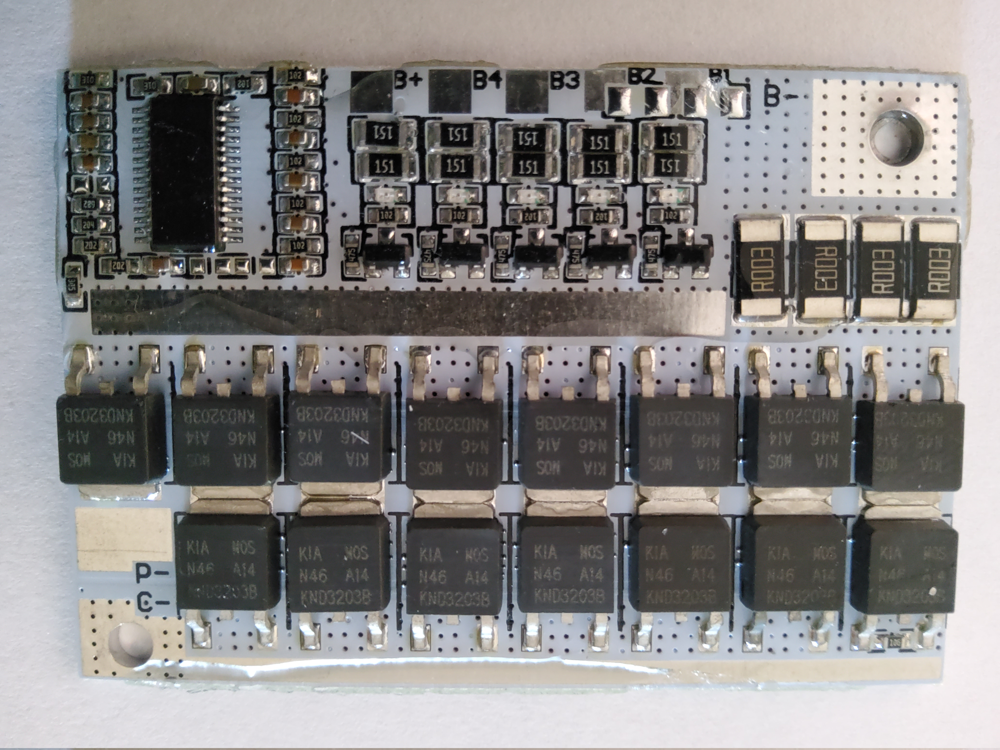
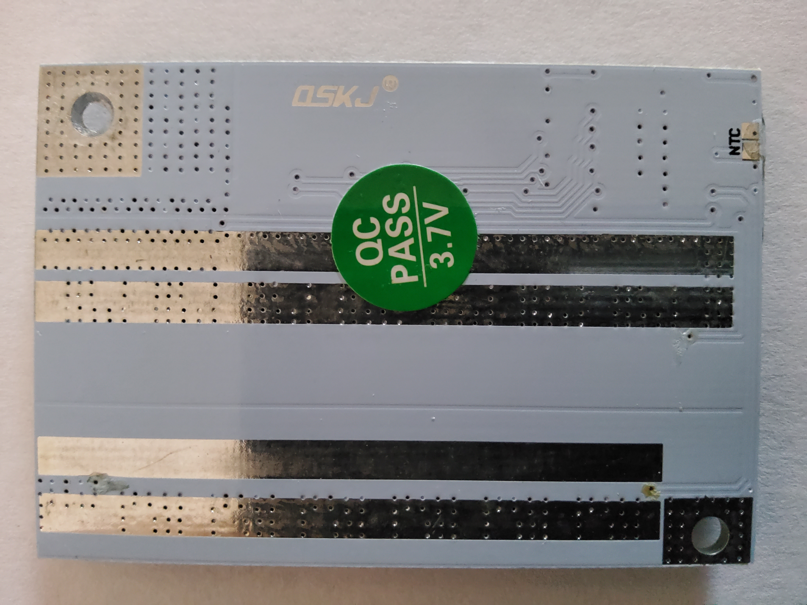
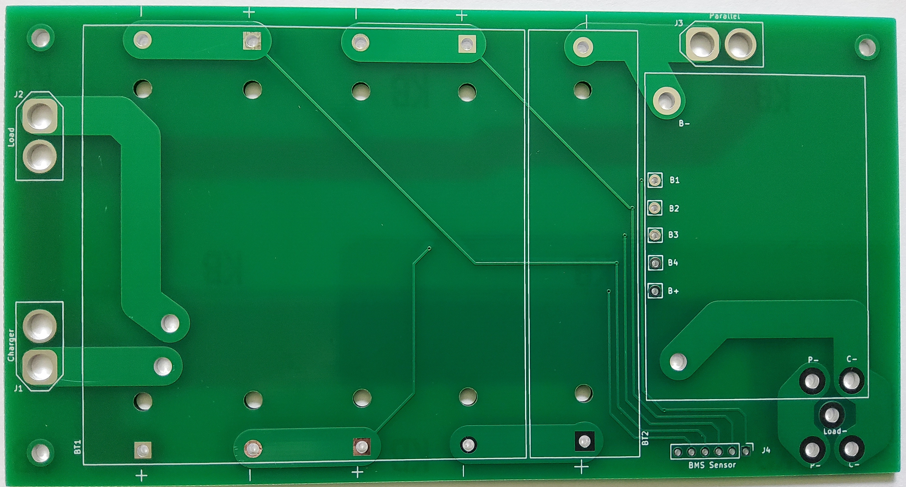
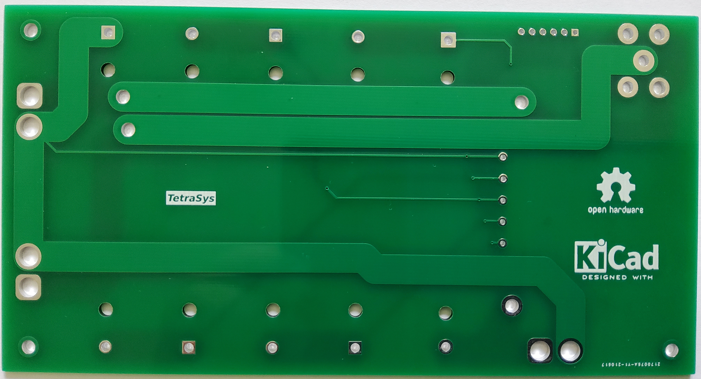

*******************
Li-Ion Battery Pack
*******************
The MIT License (MIT)

This circuit board provides the ability to manage 3 to 5 Li-Ion batteries with the BMS at this link.
`BMS Board <https://www.banggood.com/3S-4S-5S-Bms-12v-16_8V-21V-3_7V-100A-Li-ion-Lmo-Ternary-Lithium-Battery-Protection-Circuit-Board-Li-polymer-Balance-Charging-p-1834472.html?cur_warehouse=CN&ID=63059756294209&rmmds=category>`_

These are the BMS boards used:

Version 1.0 of the circuit board:

=====
KiCAD
=====

KiCAD files of the schematic and PCB.

Feel free to contact me at: carl dot nobile at gmail.com
